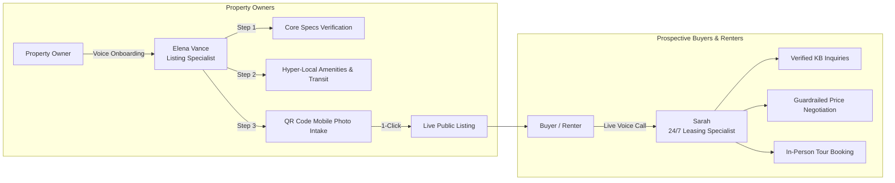

# 🏢 Kyron Realty AI 

> **Autonomous Real Estate Intelligence with Real-Time Agora Voice Agents**

[](https://nextjs.org/)
[](https://react.dev/)
[](https://www.agora.io/)
[](https://tailwindcss.com/)
[](https://www.postgresql.org/)
[](https://orm.drizzle.team/)

<br/>

[](https://egnitech.com/projects/kyron-realty-ai)

> 🚀 **Live Production Deployment:** **[https://egnitech.com/projects/kyron-realty-ai](https://egnitech.com/projects/kyron-realty-ai)**  
> *Experience the 24/7 AI Voice Sales Agent and conversational property onboarding live in your browser with zero setup.*

<br/>

**[🌐 Live Demo (egnitech.com)](https://egnitech.com/projects/kyron-realty-ai)** &bull; **[🏛️ System Architecture](#️-system-architecture)** &bull; **[🎙️ Agora Voice Engine](#-agora-products--features-used)** &bull; **[🚀 Quick Start](#-quick-start)**

---

## 🌐 Live Interactive Demo

You can explore and test the full application live in production without local setup:

🔗 **Production URL:** **[https://egnitech.com/projects/kyron-realty-ai](https://egnitech.com/projects/kyron-realty-ai)**

### What you can test live:
1. **24/7 Buyer Voice Agent (Sarah)**: Open the homepage or any public listing and click **"Talk to Agent"** to talk over Agora SD-RTN WebRTC in real time. Ask about rent, bedrooms, parking, pet policies, negotiate prices within guardrails, or schedule a tour.
2. **Conversational Onboarding (Elena Vance)**: Navigate to the onboarding studio to experience voice-guided listing creation—intake 6 core specifications, review hyper-local transit & neighborhood data, and scan a QR code to upload photos from your smartphone.
3. **Live Waveform & Transcripts**: Watch real-time audio frequency visualization and live transcription sync streamed directly via Agora RTM.

---

## 📌 Overview

**Kyron Realty AI** is a real estate platform that uses Agora to replace manual forms with real-time voice AI. Property owners can list their homes simply by talking to an AI assistant that gathers property details, verifies the location, and publishes the listing. For buyers and renters, a 24/7 voice agent answers listing questions, handles price negotiations within set limits, and schedules property tours.

### Why Kyron Realty AI?

Traditional real estate platforms suffer from severe friction on both sides of the market:

| Friction Point | Traditional Real Estate | Kyron Realty AI (Voice-First) |
| :--- | :--- | :--- |
| **Listing Onboarding** | 20–30 tedious form fields leading to high drop-offs | **2-stage conversational voice interview** completing onboarding in ~2 minutes |
| **Speed-to-Lead** | 12–48 hour inquiry delay via contact forms; lost buyer momentum | **Instant, 24/7 voice connection** answering calls with ultra-low latency (<800ms) |
| **Pricing & Negotiations** | Back-and-forth broker calls for basic concession inquiries | **Exchange-of-value negotiation engine** bound by strict owner floor prices |
| **Accuracy & Trust** | Generic chatbots that hallucinate policies and amenities | **Zero-hallucination policy** grounded in verified listing data & owner guardrails |

---

## 🎭 Dual Voice Agent Personas

Kyron Realty AI provides two specialized, dedicated voice personas designed for high-conversion real estate workflows:



### 1. Elena Vance — Principal Luxury Listing Specialist (Owner Onboarding)
- **Conversational Intake**: Eliminates web form fatigue by guiding owners through core specifications (listing type, address, price, bed/bath count, and square footage) conversationally.
- **Dynamic UI Orchestration**: Programmatically controls on-screen modals (Core Specs Review Card and Full Property Specs Window) in sync with spoken conversation.
- **Hyper-Local Intelligence**: Automatically synthesizes neighborhood transit lines, commute hubs, schools, and nearby amenities based on verified location data.
- **Mobile QR Photo Upload**: Generates an instant mobile QR code allowing owners to snap and upload high-res property photos directly from their smartphone while continuing their voice conversation.

### 2. Sarah — Senior Leasing & Sales Advisor (Buyer Inquiries)
- **Sub-Second Voice Responses**: Powered by Agora SD-RTN WebRTC and Conversational AI Cloud Gateway for seamless, interruption-aware dialogues.
- **Strict Guardrail Grounding**: Answers only from verified property knowledge bases. If a policy is unverified, Sarah transparently declines to invent facts and offers a licensed broker follow-up.
- **Exchange-of-Value Negotiation**: Programmed with strict minimum floor price guardrails and owner-approved concession rules (e.g., granting early move-in or small rent adjustments only in exchange for longer lease commitments).
- **Automated Tour Scheduling**: Qualifies prospective buyers and offers direct scheduling for in-person property walkthroughs.

---

## 🏛️ System Architecture

```mermaid
flowchart TD
    subgraph Client [Browser Client - Next.js 16 / React 19]
        Mic[User Microphone]
        UI[Interactive UI & Audio Visualizer]
        SDK[Agora RTC & RTM Web SDKs]
        Toolkit[agora-agent-client-toolkit]
    end

    subgraph AgoraCloud [Agora SD-RTN Real-Time Network]
        RTC[Agora RTC Audio Channels]
        RTM[Agora RTM Signaling & Transcripts]
        ConvoAI[Agora Conversational AI Cloud Gateway v2]
    end

    subgraph AICloud [Intelligence & Speech Pipeline]
        ASR[Agora ASR / Ares / Deepgram]
        LLM[Google Gemini 3.5 / OpenAI GPT-4o-mini]
        TTS[Agora Managed TTS / MiniMax / BYOK]
    end

    subgraph Backend [Next.js App Router Backend]
        API[/api/agora/session/start & stop]
        Tokens[agora-token Generator Dual RTC+RTM]
        DB[(PostgreSQL 17 + Drizzle ORM)]
    end

    Mic -->|Live Audio| RTC
    RTC <-->|Low-Latency Stream| ConvoAI
    ConvoAI -->|User Audio| ASR
    ASR -->|Transcribed Text| LLM
    LLM -->|Streamed Tokens| TTS
    TTS -->|Synthesized Voice| ConvoAI
    ConvoAI -->|Real-Time Text Stream| RTM
    RTM -->|Live Captions| Toolkit
    Toolkit --> UI
    
    UI -->|Start/Stop Call| API
    API --> Tokens
    Tokens --> DB
    API -->|REST v2 /join & /leave| ConvoAI
```

---

## 🎙️ Agora Products & Features Used

Kyron Realty AI is built with an Agora-only conversational architecture:

| Agora Product / Feature | Implementation Details |
| :--- | :--- |
| **Conversational AI Engine** | Manages real-time agent lifecycle via Agora Conversational AI Agent v2 REST API (`/v2/projects/{appId}/join` and `/leave`). Front-end powered by `agora-agent-client-toolkit`. |
| **Voice / RTC** | Real-time bi-directional audio capture, live waveform visualization, and sub-second agent playback using `agora-rtc-sdk-ng`. |
| **RTM (Real-Time Messaging)** | Full signaling integration via `agora-rtm` with dual-token authentication to deliver live transcript synchronization, assistant turn detection, and UI trigger events. |
| **Speech-to-Text (ASR)** | Real-time speech recognition via Agora's native speech recognition (`ares`, English) with pluggable BYOK support for Deepgram Nova-3. |
| **Text-to-Speech (TTS)** | Ultra-natural speech synthesis utilizing **Agora Managed TTS** (MiniMax `speech-2.6-turbo`) out-of-the-box, with BYOK support for Cartesia, ElevenLabs, and Azure Neural TTS. |
| **LLM Integration** | Direct server-sent events (SSE) streaming integration with Google Gemini (`gemini-3.5-flash-lite`) and OpenAI (`gpt-4o-mini`). |
| **Agora-Managed AI Models** | Built-in zero-configuration TTS and ASR requiring no third-party cloud subscription keys. |
| **Custom / BYOK AI Provider** | Support for Bring-Your-Own-Key across LLM, TTS, and ASR layers via environment configuration. |
| **Agora REST APIs** | Automated agent session orchestration from Next.js server actions and API route handlers. |
| **Agora Skills** | Guided by the official Agora development skill for token lifecycle, toolkit event ordering, and conversational AI best practices. |

---

## 🛠️ Tech Stack

- **Frontend & App Framework**: [Next.js 16](https://nextjs.org/) (App Router, Turbopack, React 19, TypeScript)
- **Voice & Real-Time Media**: [Agora SD-RTN](https://www.agora.io/) (`agora-rtc-sdk-ng`, `agora-rtm`, `agora-agent-client-toolkit`, `agora-token`)
- **AI & Intelligence**: Google Gemini 3.5 Flash-Lite / OpenAI GPT-4o-mini
- **Database & Storage**: PostgreSQL 17, [Drizzle ORM](https://orm.drizzle.team/), `postgres.js`
- **Styling**: Tailwind CSS v4, Lucide Icons
- **Authentication**: NextAuth v5 (Credentials + Google OAuth)
- **Deployment & Process Management**: Ubuntu VPS, PM2 Cluster (`ecosystem.config.cjs`), Nginx Reverse Proxy, GitHub Actions CI/CD

---

## 🚀 Quick Start

### Prerequisites
- Node.js 20+ (LTS recommended)
- PostgreSQL 17 instance
- Agora Developer Account ([console.agora.io](https://console.agora.io/))

### 1. Clone & Install
```bash
git clone https://github.com/nippunrana/kyron-realty-ai.git
cd kyron-realty-ai
npm install
```

### 2. Environment Configuration
Copy the sample environment file:
```bash
cp .env.example .env
```
Open `.env` and fill in your credentials. Refer to [.env.example](.env.example) for detailed comments:
- **Database**: `DATABASE_URL` (PostgreSQL connection string)
- **Agora Credentials**: `AGORA_APP_ID`, `AGORA_APP_CERTIFICATE`, and `AGORA_CUSTOMER_ID` / `AGORA_CUSTOMER_SECRET` (or `AGORA_CONVERSATIONAL_AI_API_KEY`)
- **LLM Key**: `GEMINI_API_KEY` (Google AI Studio) or `OPENAI_API_KEY`

> **Note on TTS**: No third-party TTS subscription key is required! By default, the app automatically uses **Agora Managed TTS** (MiniMax `speech-2.6-turbo`).

### 3. Database Migration
```bash
# Generate and apply Drizzle schema migrations
npm run db:generate
npm run db:migrate
```

### 4. Start Development Server
```bash
npm run dev
```
Open [http://localhost:3000/projects/kyron-realty-ai](http://localhost:3000/projects/kyron-realty-ai) to launch the application.

---

## 📦 Database Utilities

```bash
npm run db:generate  # Generate schema migrations
npm run db:migrate   # Apply migrations to database
npm run db:studio    # Launch visual Drizzle Studio
```

---

## 🌐 Production & Deployment

The application is deployed with Next.js standalone mode under the subpath prefix `/projects/kyron-realty-ai`:

- **Process Manager**: PM2 (`ecosystem.config.cjs`) running Node cluster workers.
  ```bash
  pm2 reload ecosystem.config.cjs --update-env
  ```
- **Reverse Proxy**: Nginx handling SSL termination and static asset caching.
- **CI/CD Pipeline**: GitHub Actions (`.github/workflows/deploy.yml`) with automated zero-downtime push-to-deploy and strict Agora-only validation gates.

---

## 📄 License

This repository does not include a license file yet.

---

## 🤝 Acknowledgments

- Built with [Agora](https://www.agora.io/) Real-Time Voice and Conversational AI Engine.
- Powered by [Google Gemini](https://ai.google.dev/) for intelligent property synthesis.
