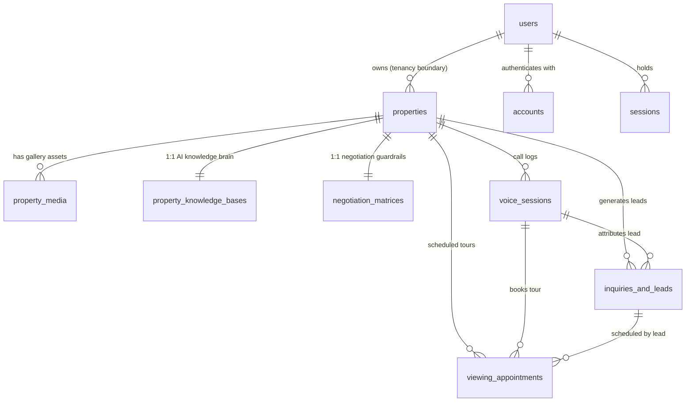

# Kyron Realty AI — Database Architecture & Data Dictionary

> **Single Source of Truth**: [`src/db/schema.ts`](file:///Users/nippunrana/Documents/projects/OSR/kyron-realty-ai/src/db/schema.ts)  
> **Pool & Connection**: [`src/db/index.ts`](file:///Users/nippunrana/Documents/projects/OSR/kyron-realty-ai/src/db/index.ts)  
> **Operational Invariants & Rules**: [`docs/built-systems/database.md`](file:///Users/nippunrana/Documents/projects/OSR/kyron-realty-ai/docs/built-systems/database.md)

---

## 1. Quick Navigation & Tables At-a-Glance

| Table | Domain | Primary Key | Description |
| :--- | :--- | :--- | :--- |
| [`users`](#1-users) | Auth & Tenancy | `id` (`text UUID`) | User accounts, credentials, and role definitions |
| [`accounts`](#2-accounts) | Auth & Tenancy | `[provider, providerAccountId]` | Linked OAuth accounts (Google, etc.) |
| [`sessions`](#3-sessions) | Auth & Tenancy | `sessionToken` (`text`) | Active user authentication sessions |
| [`verificationTokens`](#4-verificationtokens) | Auth & Tenancy | `[identifier, token]` | NextAuth passwordless / email verification tokens |
| [`properties`](#5-properties) | Core Inventory | `id` (`serial`) | Real estate listings, pricing, specs, and owner tenancy |
| [`property_media`](#6-property_media) | Core Inventory | `id` (`serial`) | Gallery photos, floor plans, and media links |
| [`property_knowledge_bases`](#7-property_knowledge_bases) | AI & Voice Agent | `id` (`serial`) | RAG context, FAQs, and hyper-local GIS intelligence |
| [`negotiation_matrices`](#8-negotiation_matrices) | AI & Voice Agent | `id` (`serial`) | Autonomous pricing limits and concession guardrails |
| [`voice_sessions`](#9-voice_sessions) | Real-Time Voice | `id` (`serial`) | Agora WebRTC call sessions, transcripts, and sentiment |
| [`inquiries_and_leads`](#10-inquiries_and_leads) | Sales & Leads | `id` (`serial`) | Active buyer/tenant leads with budget and agreed terms |
| [`viewing_appointments`](#11-viewing_appointments) | Sales & Leads | `id` (`serial`) | Scheduled property tours (in-person or virtual) |
| [`market_insights`](#12-market_insights) | Analytics | `id` (`serial`) | Macro market trends, benchmark metrics, and insights |
| [`inquiries`](#13-inquiries-deprecated) | Legacy (Deprecated) | `id` (`serial`) | Archived compatibility table (**do not use for new features**) |

---

## 2. Entity Relationship Diagram (ERD)

---

## 3. Data Dictionary

### Domain A: Auth & User Tenancy

#### 1. `users`
Represents registered platform users (landlords, investors, and administrators).

| Column | SQL Type | Modifiers | Description |
| :--- | :--- | :--- | :--- |
| `id` | `text` | `PRIMARY KEY` | Unique identifier (`crypto.randomUUID()`) |
| `name` | `text` | Nullable | Full name of the user |
| `email` | `text` | `UNIQUE` | User email address used for sign-in and notifications |
| `emailVerified` | `timestamp` | Nullable | Email confirmation timestamp |
| `image` | `text` | Nullable | Profile avatar image URL |
| `password` | `text` | Nullable | Salted password hash for NextAuth credentials provider |
| `role` | `text` | `DEFAULT 'investor'` | User role: `'investor'`, `'owner'`, or `'admin'` |
| `created_at` | `timestamp` | `NOT NULL`, `DEFAULT now()` | Account creation timestamp |
| `updated_at` | `timestamp` | `NOT NULL`, `DEFAULT now()` | Account last update timestamp |

---

#### 2. `accounts`
OAuth provider linkages for federated login (e.g., Google OAuth).

| Column | SQL Type | Modifiers | Description |
| :--- | :--- | :--- | :--- |
| `provider` | `text` | `PK (Composite)` | OAuth provider name (e.g. `'google'`) |
| `providerAccountId` | `text` | `PK (Composite)` | Unique ID returned by OAuth provider |
| `userId` | `text` | `NOT NULL`, `FK -> users.id (CASCADE)` | Associated user record |
| `type` | `text` | `NOT NULL` | Account type (e.g. `'oauth'`) |
| `access_token` | `text` | Nullable | OAuth access token |
| `refresh_token` | `text` | Nullable | OAuth refresh token |
| `expires_at` | `integer` | Nullable | Token expiration UNIX epoch |
| `token_type` | `text` | Nullable | E.g. `'Bearer'` |
| `scope` | `text` | Nullable | Granted OAuth scopes |
| `id_token` | `text` | Nullable | OIDC ID token |
| `session_state` | `text` | Nullable | Provider session state string |

---

#### 3. `sessions`
Active NextAuth user sessions.

| Column | SQL Type | Modifiers | Description |
| :--- | :--- | :--- | :--- |
| `sessionToken` | `text` | `PRIMARY KEY` | Unique active session identifier |
| `userId` | `text` | `NOT NULL`, `FK -> users.id (CASCADE)` | User ID owning the session |
| `expires` | `timestamp` | `NOT NULL` | Session expiry timestamp |

---

#### 4. `verificationTokens`
Passwordless magic links and email verification tokens.

| Column | SQL Type | Modifiers | Description |
| :--- | :--- | :--- | :--- |
| `identifier` | `text` | `PK (Composite)` | User email or identity token |
| `token` | `text` | `PK (Composite)` | Verification secret token |
| `expires` | `timestamp` | `NOT NULL` | Expiration timestamp |

---

### Domain B: Core Inventory & Media

#### 5. `properties`
Central repository for real estate listings, pricing terms, specifications, and valuation.

##### Identity & Classification
| Column | SQL Type | Modifiers | Description |
| :--- | :--- | :--- | :--- |
| `id` | `serial` | `PRIMARY KEY` | Auto-incrementing numeric ID |
| `owner_id` | `text` | `FK -> users.id (CASCADE)` | **Tenancy Boundary**: Owner of this listing |
| `slug` | `text` | `NOT NULL`, `UNIQUE` | URL-safe slug for public listing access |
| `title` | `text` | `NOT NULL` | Display headline for the listing |
| `description` | `text` | Nullable | Detailed property description |
| `listing_type` | `text` | `NOT NULL`, `DEFAULT 'rent'` | Mode: `'rent'` or `'sale'` |
| `property_type` | `text` | `NOT NULL` | Type: governed by `src/lib/property-types.ts` |
| `status` | `text` | `NOT NULL`, `DEFAULT 'active'` | `'draft'`, `'active'`, `'under_contract'`, `'closed'` |

##### Pricing & Financials
| Column | SQL Type | Modifiers | Description |
| :--- | :--- | :--- | :--- |
| `price` | `numeric(12, 2)` | `NOT NULL` | Target monthly rent or listing sale price |
| `security_deposit` | `numeric(12, 2)` | Nullable | Required security deposit |
| `min_lease_months` | `integer` | `DEFAULT 12` | Minimum lease duration in months |
| `hoa_fee_monthly` | `numeric(10, 2)` | `DEFAULT 0` | Monthly HOA/maintenance fee |

##### Physical Specifications
| Column | SQL Type | Modifiers | Description |
| :--- | :--- | :--- | :--- |
| `address` | `text` | `NOT NULL` | Street address |
| `unit_number` | `text` | Nullable | Unit, suite, or flat number |
| `city` | `text` | Nullable | City name |
| `state` | `text` | Nullable | State or province |
| `zip_code` | `text` | Nullable | Postal code |
| `country` | `text` | `DEFAULT 'India'` | Country name |
| `bedrooms` | `integer` | Nullable | Residential bedroom count |
| `bathrooms` | `numeric(3, 1)` | Nullable | Full and half bath count (e.g. 2.5) |
| `sqft` | `integer` | Nullable | Carpet area / usable area in sq. ft. |
| `floor_number` | `integer` | Nullable | Floor level (0 = ground, negative = basement) |
| `storeys` | `integer` | Nullable | Total building storeys |
| `rent_scope` | `text` | Nullable | `'whole_property'` or `'single_floor'` |
| `washrooms` | `integer` | Nullable | Commercial counterpart to bathrooms |
| `furnishing_status` | `text` | Nullable | `'bare_shell'`, `'semi_furnished'`, `'fully_furnished'` |
| `year_built` | `integer` | Nullable | Year of construction |
| `available_date` | `timestamp` | Nullable | Date available for move-in |

##### Marketing, Media & AI Knowledge
| Column | SQL Type | Modifiers | Description |
| :--- | :--- | :--- | :--- |
| `cover_image_url` | `text` | Nullable | Featured hero thumbnail |
| `images` | `jsonb` | `DEFAULT '[]'` | Array of image URLs: `string[]` |
| `amenities` | `jsonb` | `DEFAULT '[]'` | Array of amenities: `string[]` |
| `features` | `jsonb` | `DEFAULT '[]'` | Key marketing features: `string[]` |
| `knowledge_base` | `jsonb` | Nullable | **PropertyKnowledgeBaseData**: Unified RAG intelligence, sales pitch, hyper-local GIS context (`HyperLocalKbData`), FAQs, washroom arrangement (`washroomDetail`), and tone persona |
| `negotiation_rules` | `jsonb` | Nullable | **PropertyNegotiationRules**: Deterministic financial guardrails (`targetPrice`, `minFloorPrice`, `maxAllowedDiscountPct`, `concessionRules`, `notesForAgent`) |
| `qr_code_svg` | `text` | Nullable | Inline SVG vector QR code for print signs |
| `shareUrl` | `text` | Nullable | Public shareable link |
| `upload_token` | `text` | Nullable | Unique asset upload authorization token |
| `ai_valuation_estimate` | `numeric(12, 2)` | Nullable | Automated AI appraisal valuation |
| `ai_growth_score` | `integer` | Nullable | Investment appreciation score (1–100) |
| `onboarding_source` | `text` | `DEFAULT 'conversational_wizard'` | `'voice_chat'`, `'conversational_wizard'`, `'manual'` |
| `source_url` | `text` | Nullable | External source URL if scraped or synced |
| `created_at` | `timestamp` | `NOT NULL`, `DEFAULT now()` | Record creation timestamp |
| `updated_at` | `timestamp` | `NOT NULL`, `DEFAULT now()` | Record last modification timestamp |

---

#### 6. `property_media`
High-resolution images, floor plans, and walkthrough video assets.

| Column | SQL Type | Modifiers | Description |
| :--- | :--- | :--- | :--- |
| `id` | `serial` | `PRIMARY KEY` | Unique media asset ID |
| `property_id` | `integer` | `NOT NULL`, `FK -> properties.id (CASCADE)` | Parent listing |
| `media_type` | `text` | `NOT NULL`, `DEFAULT 'image'` | `'image'`, `'floorplan'`, `'virtual_tour'`, `'video'` |
| `url` | `text` | `NOT NULL` | Direct CDN / storage URL |
| `caption` | `text` | Nullable | Descriptive label for media display |
| `sort_order` | `integer` | `DEFAULT 0` | Display sorting priority order |
| `created_at` | `timestamp` | `NOT NULL`, `DEFAULT now()` | Upload timestamp |

---

### Domain C: AI Knowledge & Negotiation Rules (Consolidated)

> **Architectural Decision**: Previously, `property_knowledge_bases` and `negotiation_matrices` existed as separate 1:1 child tables with duplicate mirrored search columns (`city`, `state`, `listing_type`, `price`). These have been consolidated directly into `properties.knowledge_base` and `properties.negotiation_rules` (JSONB).
>
> **Benefits**:
> 1. Eliminates multi-table write transactions and synchronization drift.
> 2. Enables single-query reads across all conversational endpoints (`agora-agent-client`, discovery search, listings detail).
> 3. Eliminates table joins in property search and discovery queries.

---

### Domain D: Voice Sessions, Leads & Appointments

#### 9. `voice_sessions`
Audit log and transcripts for real-time Agora SD-RTN calls.

| Column | SQL Type | Modifiers | Description |
| :--- | :--- | :--- | :--- |
| `id` | `serial` | `PRIMARY KEY` | Session ID |
| `property_id` | `integer` | `FK -> properties.id (SET NULL)` | Listing discussed during the call |
| `channel_name` | `text` | `NOT NULL` | Agora WebRTC channel name |
| `agora_session_id` | `text` | Nullable | Cloud Gateway session identifier |
| `caller_type` | `text` | `NOT NULL`, `DEFAULT 'buyer_inquiry'`| `'buyer_inquiry'` or `'owner_onboarding'` |
| `caller_identifier` | `text` | Nullable | Caller phone number or client identifier |
| `duration_seconds` | `integer` | `DEFAULT 0` | Call duration in seconds |
| `turn_count` | `integer` | `DEFAULT 0` | Number of conversational turns |
| `transcript` | `jsonb` | `DEFAULT '[]'` | Transcript: `Array<{ role, content, timestamp }>` |
| `call_summary` | `text` | Nullable | AI-generated call recap |
| `lead_interest_score` | `integer` | Nullable | Buyer intent score (0–100) |
| `sentiment_analysis` | `text` | Nullable | Detected sentiment (e.g. `'enthusiastic'`) |
| `status` | `text` | `DEFAULT 'active'` | `'active'`, `'completed'`, or `'failed'` |
| `started_at` | `timestamp` | `NOT NULL`, `DEFAULT now()` | Call start timestamp |
| `ended_at` | `timestamp` | Nullable | Call termination timestamp |

---

#### 10. `inquiries_and_leads`
Active qualified buyer and tenant leads (captured via voice agent or web interface).

| Column | SQL Type | Modifiers | Description |
| :--- | :--- | :--- | :--- |
| `id` | `serial` | `PRIMARY KEY` | Lead ID |
| `property_id` | `integer` | `NOT NULL`, `FK -> properties.id (CASCADE)` | Target property listing |
| `voice_session_id` | `integer` | `FK -> voice_sessions.id (SET NULL)` | Originating voice call (if lead was captured via phone) |
| `name` | `text` | `NOT NULL` | Prospect full name |
| `email` | `text` | Nullable | Prospect email |
| `phone` | `text` | Nullable | Prospect phone number |
| `preferred_contact_method`| `text` | `DEFAULT 'phone'` | Preferred channel (`'phone'`, `'email'`, `'whatsapp'`) |
| `intent` | `text` | `NOT NULL`, `DEFAULT 'rent'` | `'rent'` or `'buy'` |
| `budget_max` | `numeric(12, 2)` | Nullable | Maximum stated budget |
| `move_in_target_date` | `timestamp` | Nullable | Desired move-in date |
| `has_pets` | `boolean` | Nullable | Pet ownership status |
| `occupants_count` | `integer` | Nullable | Number of intended occupants |
| `negotiated_price` | `numeric(12, 2)` | Nullable | Price agreed upon with voice agent |
| `agreed_terms` | `text` | Nullable | Stated terms or concessions accepted during call |
| `lead_status` | `text` | `DEFAULT 'new'` | `'new'`, `'contacted'`, `'qualified'`, `'lost'` |
| `lead_score` | `integer` | `DEFAULT 50` | Qualification score (1–100) |
| `notes` | `text` | Nullable | Agent notes or follow-up instructions |
| `created_at` | `timestamp` | `NOT NULL`, `DEFAULT now()` | Lead creation timestamp |
| `updated_at` | `timestamp` | `NOT NULL`, `DEFAULT now()` | Lead update timestamp |

---

#### 11. `viewing_appointments`
Property tours scheduled autonomously during voice calls or through the website.

| Column | SQL Type | Modifiers | Description |
| :--- | :--- | :--- | :--- |
| `id` | `serial` | `PRIMARY KEY` | Appointment ID |
| `property_id` | `integer` | `NOT NULL`, `FK -> properties.id (CASCADE)` | Listing to be toured |
| `lead_id` | `integer` | `NOT NULL`, `FK -> inquiries_and_leads.id (CASCADE)`| Lead attending the appointment |
| `voice_session_id` | `integer` | `FK -> voice_sessions.id (SET NULL)` | Voice session where tour was booked |
| `tour_type` | `text` | `NOT NULL`, `DEFAULT 'in_person'`| `'in_person'` or `'virtual'` |
| `scheduled_start` | `timestamp` | `NOT NULL` | Appointment start time |
| `scheduled_end` | `timestamp` | `NOT NULL` | Appointment end time |
| `status` | `text` | `NOT NULL`, `DEFAULT 'confirmed'`| `'confirmed'`, `'rescheduled'`, `'cancelled'`, `'completed'` |
| `attendee_name` | `text` | `NOT NULL` | Name of attendee |
| `attendee_email` | `text` | Nullable | Email address for calendar invite |
| `attendee_phone` | `text` | Nullable | Phone number for SMS reminders |
| `special_requests` | `text` | Nullable | Notes (e.g. wheelchair access, specific focus) |
| `created_at` | `timestamp` | `NOT NULL`, `DEFAULT now()` | Booking timestamp |

---

### Domain E: Analytics & Legacy Tables

#### 12. `market_insights`
Regional pricing and real estate macro indicators.

| Column | SQL Type | Modifiers | Description |
| :--- | :--- | :--- | :--- |
| `id` | `serial` | `PRIMARY KEY` | Metric record ID |
| `region` | `text` | `NOT NULL` | Geographical market region (e.g. `'Gurgaon'`) |
| `metric_name` | `text` | `NOT NULL` | Metric identifier (e.g. `'avg_rent_sqft'`) |
| `metric_value` | `numeric(10, 2)` | `NOT NULL` | Numerical value |
| `trend_direction` | `text` | `NOT NULL` | Direction indicator (`'up'`, `'down'`, `'flat'`) |
| `ai_analysis_summary` | `text` | Nullable | AI commentary on market dynamics |
| `recorded_at` | `timestamp` | `NOT NULL`, `DEFAULT now()` | Metric timestamp |

---

#### 13. `inquiries` (⚠️ Deprecated)

> [!WARNING]
> **Legacy Table Only**: Do **not** write new application features against `inquiries`. All modern lead capture must target [`inquiries_and_leads`](#10-inquiries_and_leads).

| Column | SQL Type | Modifiers | Description |
| :--- | :--- | :--- | :--- |
| `id` | `serial` | `PRIMARY KEY` | Legacy inquiry ID |
| `property_id` | `integer` | `FK -> properties.id` | Target property |
| `name` | `text` | `NOT NULL` | Inquirer name |
| `email` | `text` | `NOT NULL` | Inquirer email |
| `phone` | `text` | Nullable | Inquirer phone |
| `message` | `text` | `NOT NULL` | Inquiry text message |
| `ai_sentiment` | `text` | Nullable | Sentiment flag |
| `is_processed` | `boolean` | `DEFAULT false` | Processing flag |
| `created_at` | `timestamp` | `NOT NULL`, `DEFAULT now()` | Submission date |

---

## 4. Key Operational Rules & Constraints

1. **Tenancy Boundary (`properties.owner_id`)**:
   - The user dashboard strictly filters properties where `owner_id = session.user.id` (or `owner_id IS NULL` for pre-authentication legacy rows).
   - Never remove or loosen this query constraint.
2. **Cascade Deletion Policies**:
   - Deleting a `property` automatically cascades deletions to `property_media`, `property_knowledge_bases`, `negotiation_matrices`, `inquiries_and_leads`, and `viewing_appointments`.
   - `voice_sessions` retain historical audit records by setting `property_id` to `NULL` (`ON DELETE SET NULL`).
3. **Lead Capture Policy**:
   - **Never** insert new leads into `inquiries`. Always write to `inquiries_and_leads`.
4. **Zero Push / No Raw DDL**:
   - All schema changes must be declared in [`src/db/schema.ts`](file:///Users/nippunrana/Documents/projects/OSR/kyron-realty-ai/src/db/schema.ts), compiled via `npm run db:generate`, and deployed automatically via CI/CD migration scripts (`drizzle-kit migrate`).
